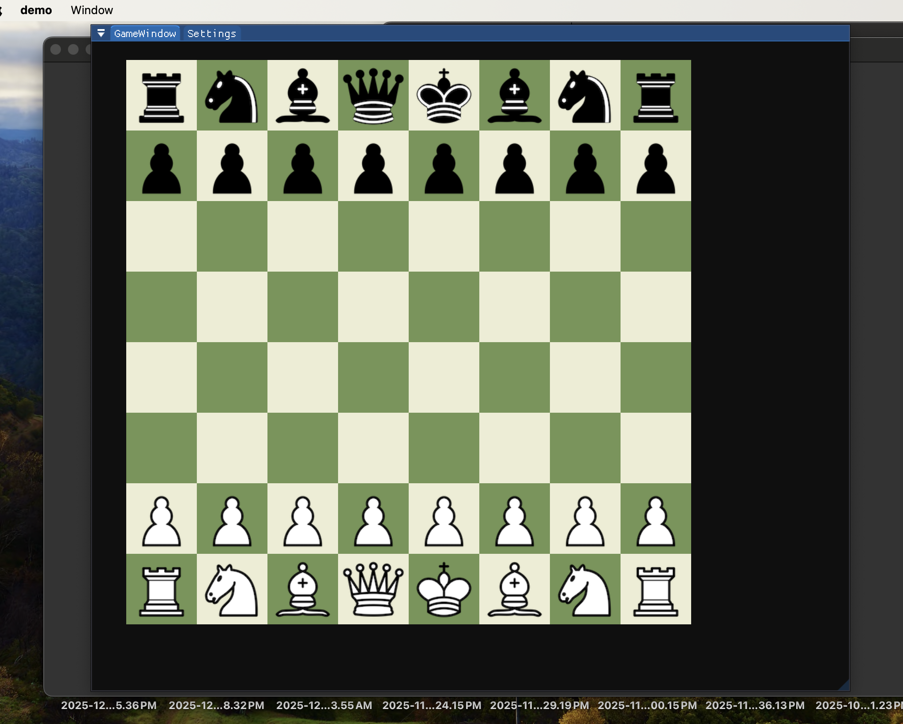
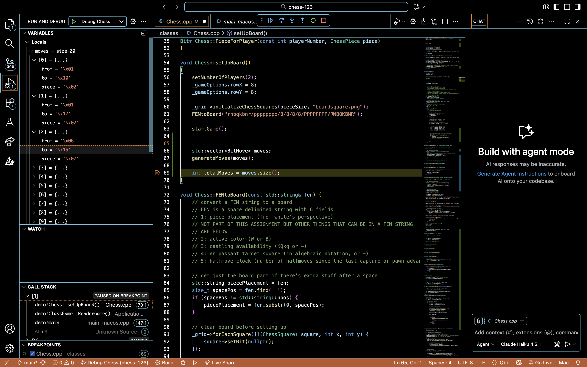

# CMPM 123 - Chess Move Generation

**Author:** Miga Damdinbazar
**Platform:** macOS (Darwin 23.3.0)
**Date:** March 8, 2026

## What I Did

Implemented complete legal move generation for all chess pieces (pawns, knights, bishops, rooks, queens, and kings). The move generator creates a list of all valid moves for the current player, validates piece movement according to chess rules, and handles captures. The game now supports full two-player human chess with turn-based play.

## Features

- FEN string parsing to set up any board position
- Move generation for all pieces:
  - Pawns (forward movement + diagonal captures)
  - Knights (L-shaped jumps using bitboards)
  - Bishops (diagonal sliding)
  - Rooks (horizontal and vertical sliding)
  - Queens (combination of rook + bishop movement)
  - Kings (one square in any direction using bitboards)
- Proper capture detection and piece removal
- Turn-based validation (can only move your own pieces)
- Sliding piece logic that stops at edges and blocking pieces

## How It Works

The chess game uses the same framework as the other games (TicTacToe, Checkers, etc.). I added move generation logic that runs whenever you try to move a piece. Instead of allowing any move like before, it now checks if the move is actually legal according to chess rules.

### FEN String Setup

First I implemented FEN string parsing so we can easily test different positions. FEN is just a way to write out where all the pieces are:

```cpp
FENtoBoard("rnbqkbnr/pppppppp/8/8/8/8/PPPPPPPP/RNBQKBNR");
```

The function reads through the string character by character. Lowercase letters are black pieces (r=rook, n=knight, etc.), uppercase are white pieces. Numbers mean empty squares. Slashes mean go to the next rank.

```cpp
for (char c : piecePlacement) {
    if (c == '/') {
        y--;  // Next rank down
        x = 0;
    } else if (c >= '1' && c <= '8') {
        x += (c - '0');  // Skip empty squares
    } else {
        // Create the piece and put it on the board
        bool isWhite = (c >= 'A' && c <= 'Z');
        ChessPiece pieceType = getPieceType(c);
        Bit* piece = PieceForPlayer(isWhite ? 0 : 1, pieceType);
        _grid->getSquare(x, y)->setBit(piece);
        x++;
    }
}
```

### Move Generation

The main function is `generateMoves()` which loops through all 64 squares, finds pieces belonging to the current player, and generates their legal moves:

```cpp
void Chess::generateMoves(std::vector<BitMove>& moves)
{
    moves.clear();
    int currentPlayerNum = getCurrentPlayer()->playerNumber();
    bool isWhite = (currentPlayerNum == 0);

    for (int y = 0; y < 8; y++) {
        for (int x = 0; x < 8; x++) {
            auto square = _grid->getSquare(x, y);
            if (!square || !square->bit()) continue;

            Bit* piece = square->bit();
            bool pieceIsWhite = isWhitePiece(piece->gameTag());
            if (pieceIsWhite != isWhite) continue;  // Not our piece

            int squareIndex = y * 8 + x;
            ChessPiece pieceType = getPieceType(piece->gameTag());

            switch (pieceType) {
                case Pawn:   generatePawnMoves(squareIndex, moves); break;
                case Knight: generateKnightMoves(squareIndex, moves); break;
                case King:   generateKingMoves(squareIndex, moves); break;
                default: break;
            }
        }
    }
}
```

Each piece type has its own function for generating moves.

### Pawn Movement

Pawns were the trickiest because they move differently than they capture. They move forward but capture diagonally, and they can move 2 squares from their starting position.

```cpp
void Chess::generatePawnMoves(int square, std::vector<BitMove>& moves)
{
    int x, y;
    squareToCoords(square, x, y);

    bool isWhite = isWhitePiece(_grid->getSquare(x, y)->bit()->gameTag());
    int direction = isWhite ? 1 : -1;  // White moves up, black moves down
    int startRank = isWhite ? 1 : 6;

    // Forward one square
    int newY = y + direction;
    if (newY >= 0 && newY < 8 && !isSquareOccupied(x, newY)) {
        moves.push_back(BitMove(square, coordsToSquare(x, newY), Pawn));

        // Forward two squares from starting position
        if (y == startRank) {
            int doubleY = y + (direction * 2);
            if (!isSquareOccupied(x, doubleY)) {
                moves.push_back(BitMove(square, coordsToSquare(x, doubleY), Pawn));
            }
        }
    }

    // Diagonal captures
    for (int dx = -1; dx <= 1; dx += 2) {  // -1 and +1
        int captureX = x + dx;
        int captureY = y + direction;
        if (captureX >= 0 && captureX < 8 && captureY >= 0 && captureY < 8) {
            if (isSquareOccupiedByEnemy(captureX, captureY, isWhite)) {
                moves.push_back(BitMove(square, coordsToSquare(captureX, captureY), Pawn));
            }
        }
    }
}
```

The key parts are checking if the forward square is empty (can't capture forward), and only allowing diagonal moves if there's an enemy piece there.

### Knight Movement with Bitboards

Knights are easier once you use bitboards. A bitboard is just a 64-bit number where each bit represents a square on the board. I used the pre-calculated lookup table from MagicBitboards.h that has all the knight moves for every square already computed.

```cpp
void Chess::generateKnightMoves(int square, std::vector<BitMove>& moves)
{
    int x, y;
    squareToCoords(square, x, y);
    bool isWhite = isWhitePiece(_grid->getSquare(x, y)->bit()->gameTag());

    uint64_t attacks = KnightAttacks[square];

    for (int targetSquare = 0; targetSquare < 64; targetSquare++) {
        if (attacks & (1ULL << targetSquare)) {  // Is this square attacked?
            int targetX, targetY;
            squareToCoords(targetSquare, targetX, targetY);

            // Can move if square is empty or has enemy piece
            if (!isSquareOccupied(targetX, targetY) ||
                isSquareOccupiedByEnemy(targetX, targetY, isWhite)) {
                moves.push_back(BitMove(square, targetSquare, Knight));
            }
        }
    }
}
```

The `KnightAttacks[square]` lookup table already has all 8 possible L-shaped moves for that square. I just check each bit to see which squares are attacked, then make sure the square is either empty or has an enemy piece.

### King Movement

King movement works the same way as knights but with the `KingAttacks[]` table instead:

```cpp
void Chess::generateKingMoves(int square, std::vector<BitMove>& moves)
{
    int x, y;
    squareToCoords(square, x, y);
    bool isWhite = isWhitePiece(_grid->getSquare(x, y)->bit()->gameTag());

    uint64_t attacks = KingAttacks[square];

    for (int targetSquare = 0; targetSquare < 64; targetSquare++) {
        if (attacks & (1ULL << targetSquare)) {
            int targetX, targetY;
            squareToCoords(targetSquare, targetX, targetY);

            if (!isSquareOccupied(targetX, targetY) ||
                isSquareOccupiedByEnemy(targetX, targetY, isWhite)) {
                moves.push_back(BitMove(square, targetSquare, King));
            }
        }
    }
}
```

Kings can move one square in any of the 8 directions, so the bitboard has up to 8 bits set.

### Sliding Pieces (Rooks, Bishops, Queens)

For rooks, bishops, and queens, I implemented sliding logic that moves in a direction until hitting a piece or the edge of the board.

**Rooks** slide horizontally and vertically (4 directions):

```cpp
void Chess::generateRookMoves(int square, std::vector<BitMove>& moves)
{
    int x, y;
    squareToCoords(square, x, y);
    bool isWhite = isWhitePiece(_grid->getSquare(x, y)->bit()->gameTag());

    int directions[4][2] = {{0, 1}, {0, -1}, {1, 0}, {-1, 0}};

    for (int dir = 0; dir < 4; dir++) {
        int dx = directions[dir][0];
        int dy = directions[dir][1];

        for (int dist = 1; dist < 8; dist++) {
            int targetX = x + (dx * dist);
            int targetY = y + (dy * dist);

            if (targetX < 0 || targetX >= 8 || targetY < 0 || targetY >= 8) break;

            if (isSquareOccupied(targetX, targetY)) {
                if (isSquareOccupiedByEnemy(targetX, targetY, isWhite)) {
                    moves.push_back(BitMove(square, coordsToSquare(targetX, targetY), Rook));
                }
                break;
            }

            moves.push_back(BitMove(square, coordsToSquare(targetX, targetY), Rook));
        }
    }
}
```

**Bishops** work the same way but slide diagonally (4 diagonal directions). The only difference is the direction vectors: `{{1, 1}, {1, -1}, {-1, 1}, {-1, -1}}`.

**Queens** combine both rook and bishop movement:

```cpp
void Chess::generateQueenMoves(int square, std::vector<BitMove>& moves)
{
    generateRookMoves(square, moves);
    generateBishopMoves(square, moves);

    for (auto& move : moves) {
        if (move.from == square && (move.piece == Rook || move.piece == Bishop)) {
            move.piece = Queen;
        }
    }
}
```

The sliding logic:
1. Loop through each direction
2. Step outward 1 square at a time (dist = 1, 2, 3...)
3. Stop if we hit the edge of the board
4. Stop if we hit a piece (capture it if it's an enemy)
5. Add each legal square as a move

### Move Validation

When you try to move a piece, the game calls `canBitMoveFromTo()` which generates all legal moves and checks if your attempted move is in the list:

```cpp
bool Chess::canBitMoveFromTo(Bit &bit, BitHolder &src, BitHolder &dst)
{
    ChessSquare* srcSquare = dynamic_cast<ChessSquare*>(&src);
    ChessSquare* dstSquare = dynamic_cast<ChessSquare*>(&dst);

    int srcX = srcSquare->getColumn();
    int srcY = srcSquare->getRow();
    int dstX = dstSquare->getColumn();
    int dstY = dstSquare->getRow();

    int fromSquare = coordsToSquare(srcX, srcY);
    int toSquare = coordsToSquare(dstX, dstY);

    std::vector<BitMove> legalMoves;
    generateMoves(legalMoves);

    ChessPiece pieceType = getPieceType(bit.gameTag());
    for (const auto& move : legalMoves) {
        if (move.from == fromSquare && move.to == toSquare && move.piece == pieceType) {
            return true;
        }
    }

    return false;
}
```

### Captures

When a piece lands on a square with an enemy piece, the enemy piece gets deleted:

```cpp
void Chess::bitMovedFromTo(Bit &bit, BitHolder &src, BitHolder &dst)
{
    ChessSquare* dstSquare = dynamic_cast<ChessSquare*>(&dst);

    if (dstSquare) {
        Bit* capturedPiece = dstSquare->bit();
        if (capturedPiece && capturedPiece != &bit) {
            delete capturedPiece;
        }
    }

    Game::bitMovedFromTo(bit, src, dst);
}
```

This happens automatically after the move is validated, so captures just work.

## Files I Added/Changed

**New Files:**
- `classes/BitMove.h` - BitMove struct for storing moves (from/to/piece) and BitboardElement helper class (~100 lines)
- `classes/MagicBitboards.h` - Pre-calculated attack tables for knights and kings (~150 lines)

**Modified:**
- `classes/Chess.h` - Added move generation function declarations for all pieces (~25 lines added)
- `classes/Chess.cpp` - Implemented complete move generation for all 6 piece types (~300 lines added)
- `classes/ChessSquare.cpp` - Minor updates to drop validation (~5 lines)

## What's Not Implemented

- En Passant (special pawn capture)
- Castling (king+rook move)
- Pawn Promotion (pawn reaching end of board)
- Check detection
- Checkmate detection

## Testing

The move generator produces exactly 20 legal moves from the starting position:
- 8 pawn moves (each of the 8 pawns can move forward 1 square)
- 8 pawn double moves (each pawn can move forward 2 squares from start)
- 4 knight moves (2 knights × 2 moves each)

**Why only 20 moves?** In the starting position, bishops, rooks, queens, and kings have no legal moves because they're completely blocked by pawns and other pieces. The sliding pieces will show in the move list once the game progresses and they have space to move.

I tested this by setting a breakpoint in the debugger and inspecting the moves array.

## Problems I Ran Into

**Problem 1: Piece tags not being set**

When I first tested the move generation, pieces had gameTag = 0 which meant `getPieceType()` couldn't tell what piece it was. The move generator would run but generate 0 moves.

Turned out `PieceForPlayer()` wasn't setting the gameTag. I added:

```cpp
int gameTag = piece + (playerNumber == 1 ? 128 : 0);
bit->setGameTag(gameTag);
```

Now white pieces have tags 1-6 and black pieces have tags 129-134.

**Problem 2: Coordinate system confusion**

The grid uses (x, y) where x is the column (0-7 left to right) and y is the row (0-7 bottom to top). But bitboards use a single index 0-63 going left to right, bottom to top. I kept getting moves on the wrong squares.

Made helper functions to convert:

```cpp
int coordsToSquare(int x, int y) { return y * 8 + x; }
void squareToCoords(int square, int& x, int& y) { x = square % 8; y = square / 8; }
```

That fixed all the coordinate bugs.

**Problem 3: Pawns moving backward**

Black pawns were trying to move up the board instead of down. I had the direction hardcoded wrong.

Fixed it by checking piece color:

```cpp
int direction = isWhite ? 1 : -1;
```

White pawns move from y=1 toward y=7 (up), black pawns move from y=6 toward y=0 (down).

## Design Choices

**Bitboards:** Used pre-calculated lookup tables for knights and kings instead of computing moves each time. Way faster and cleaner code.

**BitMove struct:** Stores from square, to square, and piece type. Simple and matches what the assignment asked for.

**Move list:** Used `std::vector<BitMove>` instead of a fixed array. Don't have to worry about array size and can easily check how many moves there are.

**Piece identification:** Used the gameTag system that was already there. Lower 3 bits = piece type (1-6), bit 8 = color (0 for white, 128 for black).

## Time Spent

About 4-5 hours total. Roughly 2 hours getting bitboards and move generation working, 1 hour on pawn logic, 1 hour debugging the coordinate issues, and another hour testing and fixing bugs.

## Screenshots

  ### Chess Board Starting Position
  

  ### Move Generation Debug (20 moves)
  

## References

- Sebastian Lague's Coding Adventure: Chess video on YouTube
- Chess Programming Wiki for bitboard basics
- The assignment instructions and provided BitMove.h code
- Looked at the existing TicTacToe and Checkers code to understand the framework